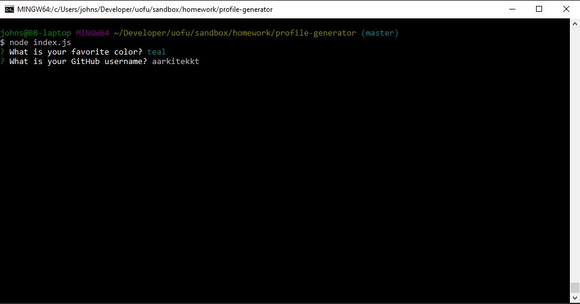
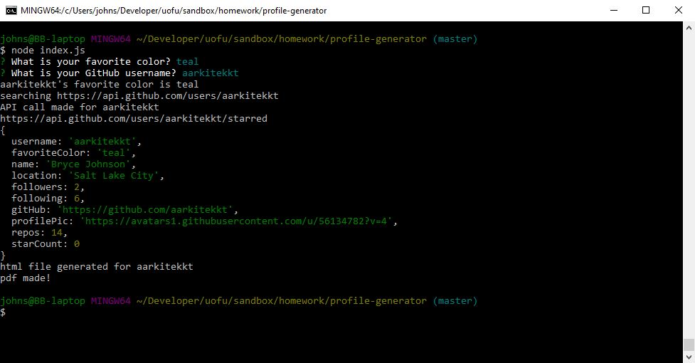

# Profile Generator
Repository: https://github.com/aarkitekkt/profile-generator

​
## Overview
​
The purpose of this command-line application is to dynamically generate a GitHub user profile following a few prompts and save profile as a .pdf document.
​
## Gallery
​
Prompts:

Progress Logs:

​
Generated Profile:

​
## Problem
The biggest problem faced with this application was generating the pdf once all of the data was collected.

## Solution
​
My solution was to take the retrieved data from the API calls and user prompts to append necessary information into an object.  This new object data was used to fill in content in an html template which was saved as a variable.
Finally, using Puppeteer npm, this html variable was passed into a function that would generate and save a pdf displaying the users information.
​
## Tech and Features Used
​
* NodeJS
* Bootstrap
* Javascript
* Puppeteer npm
* Axios npm
* Inquirer npm
* GitHub API
​
## How to use
​
Simply answer two user prompts to recieve a pdf of users GitHub profile.
​
## Technical Overview
​
1. Using Inquirer npm, the user is asked two questions(favorite color and GitHub user name).
2. A function retrieves the answers and assigns them to a userInfo object variable to be used later. 
3. Using the given GitHub user name, a function builds a URL to query the GitHub API.  After the API call is complete, the relevent data is pulled from the returned object and assigned to the userInfo variable. 
4. A second URL with different parameters is generated and API call made to return star information and the applied to userInfo variable.
5. A function takes the userInfo object and appends the data to an html template to display the corresponding information for the user. This html file is then saved as a variable.
6. Using Puppeteer npm, this html variable is passed through a function to create and then save a pdf of a GitHub user profile. The file named according to the users profile name.
